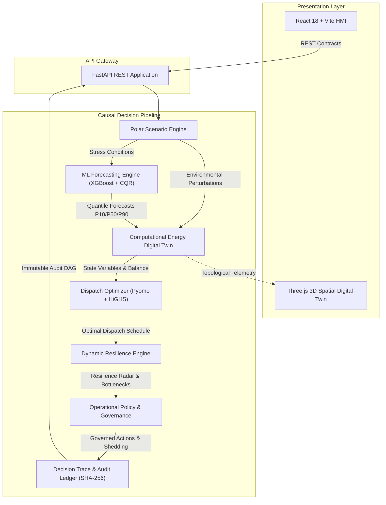

# Polaris-EMS
## Polar Energy Management & Resilience System

Polaris-EMS is a computational energy management and resilience platform for polar research stations.

### Live Demo
🌐 **[https://polaris-ems.vercel.app](https://polaris-ems.vercel.app)**  
*Unified production deployment running the complete Polaris-EMS stack: React HMI, FastAPI backend, computational energy digital twin, ML forecasting, HiGHS optimization, resilience assessment, policy governance, and explainable decision trace.*

[](tests)
[](frontend)
[](frontend)
[](frontend)
[](https://polaris-ems.vercel.app)
[](backend/core/provenance.py)
[](Dockerfile)

---

## 1. Overview

Polar research stations operate in some of the most isolated and challenging operational environments on Earth. Facilities must endure temperatures down to **-50°C**, prolonged blizzards with violent wind gusts, complete absence of solar irradiance during polar night, finite diesel fuel storage, and logistics windows restricted by maritime ice conditions.

Polaris-EMS combines probabilistic machine learning forecasting, computational state modeling, extreme scenario stress testing, constrained optimization, multidimensional resilience assessment, policy governance, and explainable decision auditing into a unified decision-support workflow.

```text
Predict → Model → Stress Test → Optimize → Assess → Govern → Explain
```

Polaris-EMS is an advisory computational platform designed to assist station engineers and energy planners in maintaining life-support continuity, managing generation and storage, and extending mission survival horizons. It is a computational decision-support system; it does not claim live physical SCADA connectivity or direct autonomous physical switchgear actuation.

---

## 2. Why It Exists

Operating a polar microgrid presents acute engineering challenges that conventional energy management systems are not designed to handle:

- **Severe Cold Distorts Demand**: Extreme ambient temperatures drive heavy non-linear heating loads, making building thermal dynamics inseparable from electrical dispatch.
- **Extreme Weather & Polar Night**: Solar generation ceases entirely during winter polar night and surges during summer continuous daylight. Wind generation is highly volatile and cuts out during extreme storm gusts.
- **Temperature-Dependent Storage**: Battery electrochemical efficiency and usable capacity degrade significantly in sub-zero environments, shrinking usable energy reserves.
- **Finite Fuel & Severe Isolation**: Polar stations rely on diesel fuel delivered once or twice annually. A suboptimal dispatch regime in autumn directly threatens winter survival.
- **Critical-Load Protection**: Life support, medical facilities, station atmospheric heating, and satellite communications cannot tolerate supply interruption.
- **Uncertainty Propagation**: Deterministic forecasts create fragile schedules; operational planning must incorporate calibrated prediction intervals to maintain reliable spinning reserves.

Polaris-EMS addresses these intertwined physical constraints within a unified, constraint-aware decision framework.

---

## 3. System Workflow

The Polaris-EMS decision pipeline executes across seven coordinated stages:

```text
Scenario Engine
      ↓
ML Forecaster
      ↓
Computational Twin
      ↓
Optimizer (Pyomo + HiGHS)
      ↓
Resilience Engine
      ↓
Policy Engine
      ↓
Decision Trace
```

1. **Scenario Engine**: Imposes canonical polar operating conditions or compound environmental disruptions.
2. **ML Forecaster**: Predicts load demand and renewable generation with conformalized uncertainty intervals ($P_{10}, P_{50}, P_{90}$).
3. **Computational Energy Digital Twin**: Evaluates multi-physics electrical power balance, building thermal dynamics, battery state-of-charge, and diesel consumption.
4. **Optimizer**: Computes constrained, cost- and reserve-optimal dispatch schedules using mixed-integer linear programming (MILP).
5. **Resilience Engine**: Assesses station survivability across multiple operational dimensions and identifies binding constraints.
6. **Policy Engine**: Applies operational governance rules and priority-based load shedding hierarchies.
7. **Decision Trace**: Records immutable, cryptographically verifiable decision records explaining the full rationale behind every action.

All components interact as a single causal decision chain: scenario perturbations directly alter forecasts, twin state variables, solver dispatch, resilience metrics, and trace lineage without manual intervention.

---

## 4. Key Capabilities

### Probabilistic Forecasting
- Multi-horizon forecasting across station load demand, solar PV generation, and wind turbine output.
- Physics-informed baseline decomposition combined with gradient-boosted residual learners (XGBoost).
- Conformalized Quantile Regression (CQR) delivering calibrated prediction intervals ($P_{10}$, $P_{50}$, $P_{90}$) to safeguard downstream dispatch against forecast error.
- Multi-scale horizons supporting short-term operational dispatch (1h to 24h) and long-range strategic fuel planning (up to 168h).

### Computational Energy Twin
- **Electrical Subsystem**: Strict Kirchhoff power balance enforcement ($\sum P_{\text{gen}} = \sum P_{\text{load}}$).
- **Thermal Subsystem**: Dynamic building thermal envelope modeling considering ambient temperature, building heat loss coefficients, internal gains, and heating dispatch.
- **Battery Subsystem**: Electrochemical storage modeling incorporating charge/discharge efficiency, temperature-dependent capacity derating, and cycle life constraints.
- **Fuel Subsystem**: Non-linear generator fuel consumption curves and calibrated tank reserve monitoring.
- **Load Disaggregation**: Three-tier load classification separating Critical (life support, habitats), Essential (scientific equipment, communications), and Flexible (discretionary) circuits.

### Polar Stress Scenarios
Built-in scenario presets reflecting verified polar operational stresses:
- **Blizzard**: Severe wind gust cutout, total solar suppression, and elevated building thermal losses.
- **Extreme Cold**: Sudden temperature plunge (-45°C), battery capacity derating, and surging heating demand.
- **Polar Night**: Complete absence of solar radiation across multi-day horizons.
- **Renewable Failure**: Sudden loss of wind or solar generation assets.
- **Battery Degradation**: Accelerated storage capacity loss and elevated internal resistance.
- **Fuel Delay**: Maritime resupply denial requiring extended strategic fuel rationing.
- **Combined Polar Stress**: Compounding disruptions (storm + deep freeze + partial generation outage).

### Constraint-Aware Optimization
- Formulated in Pyomo and solved via the open-source HiGHS mixed-integer linear programming (MILP) solver.
- Rigorously enforces generator minimum uptime/downtime, ramp rate limits, battery state-of-charge limits, thermal habitability envelopes, and spinning reserve margins.
- Unconditionally protects critical life-support loads while minimizing fuel consumption and equipment wear.

### Resilience Assessment
- Evaluates multidimensional station survivability across energy adequacy, critical-load survival, thermal margin, storage buffer, fuel endurance, logistics reserve, renewable utilization, and recovery potential.
- Dynamically identifies the binding survival constraint (the critical resource bottleneck) governing station endurance under stress.

### Explainable Decision Trace
- Structured decision explanations: `Trigger → Rationale → Risk → Action`.
- Cryptographic SHA-256 lineage tracking linking inputs, model states, optimization formulations, and emitted supervisory recommendations.
- Full state reproducibility allowing operators to review why any specific dispatch recommendation was produced.

---

## 5. What Makes the Architecture Distinctive

1. **Uncertainty-Aware Planning**: Dispatch optimization does not rely solely on point forecasts; it uses conservative lower-bound renewable estimates ($P_{10}$) and upper-bound load demand ($P_{90}$) to maintain robust spinning reserves.
2. **Thermal-Electric Coupling**: Electric heating, diesel generator waste heat recovery, and building thermal inertia are optimized simultaneously rather than as disconnected systems.
3. **Resupply-Aware Planning**: Strategic dispatch horizons are anchored to seasonal logistics timelines, preventing myopic short-term fuel expenditure before resupply windows open.
4. **Mission-Aware Critical-Load Protection**: Strict priority hierarchy protects human life-support, health, and communication circuits under all operational regimes.
5. **Full-Chain Scenario Propagation**: Environmental perturbations flow organically through forecasting, physics simulation, solver optimization, and policy governance.
6. **Computational State-Driven Twin**: Grounded in multi-physics conservation laws rather than heuristic look-up tables.
7. **Explainable Decision Lineage**: Every advisory recommendation is accompanied by an audit trail detailing trigger conditions, analytical rationale, identified risks, and cryptographic hashes.

---

## 6. Technical Architecture



### Subsystem Authority Matrix

| Subsystem | Authority Responsibility | Output Contract |
|:---|:---|:---|
| **ML Forecaster** | Statistical prediction and uncertainty quantification | Calibrated multi-horizon $P_{10}, P_{50}, P_{90}$ forecast series |
| **Computational Twin** | Physical state representation and conservation laws | Multi-physics state (electrical, thermal, battery, fuel) |
| **Scenario Engine** | Environmental stress testing and parameter perturbation | Scenario parameter deltas applied to baseline models |
| **Optimizer** | Sole authority for computing asset dispatch schedules | Constrained asset commitment and dispatch schedules |
| **Resilience Engine** | Station survivability evaluation and bottleneck identification | Multidimensional radar metrics and binding survival constraints |
| **Policy Engine** | Operational governance and load-shedding hierarchy | Supervisory advisory directives and circuit shedding lists |
| **Decision Trace** | Auditability and explainability recording | Cryptographically linked `Trigger → Rationale → Risk → Action` DAG |
| **Spatial Twin** | Visual presentation and spatial orientation | Interactive 2D topological schematic & 3D WebGL visualization |

---

## 7. Technology Stack

### Frontend
- **React 18**: Component-based mission-control dashboard.
- **TypeScript**: Strict type safety across all telemetry and API contracts.
- **Vite**: Modern frontend bundling and development environment.
- **Tailwind CSS**: Cohesive, responsive design system.
- **Three.js**: Interactive 3D WebGL spatial visualization of station layouts and environmental state.
- **Lucide React**: Clean, semantic iconography.

### Backend & Core Services
- **Python 3.11+**: Core application runtime.
- **FastAPI**: Asynchronous high-performance REST API.
- **Pydantic v2**: Strict schema validation and contract serialization.

### Machine Learning & Data Processing
- **XGBoost**: Gradient-boosted decision tree residual learners.
- **scikit-learn**: Preprocessing, evaluation metrics, and baseline models.
- **NumPy & Pandas**: Vectorized scientific computing and time-series modeling.
- **SciPy**: Statistical distributions and mathematical procedures.
- **Conformalized Quantile Regression (CQR)**: Finite-sample prediction interval calibration.

### Optimization
- **Pyomo**: Algebraic modeling framework for mathematical programming.
- **HiGHS (via highspy)**: High-performance open-source mixed-integer linear programming (MILP) solver.

### Verification & Testing
- **Pytest**: Backend automated regression test suite.
- **Vitest**: Fast frontend unit and component testing.
- **React Testing Library**: Component interaction and DOM testing.

### Deployment & Infrastructure
- **Docker**: Hardened multi-stage non-root container deployment.
- **Vercel Container Runtime**: Scalable production container hosting.

---

## 8. Stations & Configuration

Polaris-EMS includes modular configuration profiles for three polar research stations:

- **Bharati Station** ($69^\circ\text{S}, 76^\circ\text{E}$, Larsemann Hills, East Antarctica): Modern coastal Antarctic station microgrid with combined wind turbines, solar PV arrays, battery storage, and multi-genset backup.
- **Maitri Station** ($70^\circ\text{S}, 11^\circ\text{E}$, Schirmacher Oasis, East Antarctica): Inland Antarctic facility experiencing heavy heating demand, diesel generation, and battery energy storage.
- **Himadri Station** ($79^\circ\text{N}, 11^\circ\text{E}$, Ny-Ålesund, Svalbard, Arctic): Arctic research base subject to severe winter polar night and rapid Arctic weather transitions.

All station characteristics—generator ratings, solar and wind capacities, battery chemistry, building thermal capacitance, and load classifications—are modularly configured in `configs/station_profiles.json` and `configs/device_profiles.json`.

---

## 9. Provenance & Physical Boundary

To ensure complete scientific and operational integrity, Polaris-EMS enforces a strict six-tier data provenance taxonomy:

```text
REAL → CONFIGURED → ASSUMED → SYNTHETIC → FORECAST → SIMULATED
```

1. **`REAL`**: Direct historical sensor logs from polar observation records.
2. **`CONFIGURED`**: Explicit engineering constants defined in station hardware specifications.
3. **`ASSUMED`**: Physics-grounded assumptions (e.g., building thermal insulation values).
4. **`SYNTHETIC`**: Mathematically generated operational scenarios and environmental stress perturbations.
5. **`FORECAST`**: Machine learning predictions with calibrated uncertainty bounds.
6. **`SIMULATED`**: Dynamic physical states computed during digital twin and optimizer execution.

### Physical Boundary Declaration

Polaris-EMS is an advisory computational decision-support platform. The current deployment operates with physical station hardware interfaces disconnected:

- **Physical Connectivity**: `DISCONNECTED`
- **Physical SCADA Interconnect**: `FALSE`
- **Field Switchgear Actuation**: `SUPPRESSED / ADVISORY ONLY`

Energy, fuel, storage, and operational states presented in the demonstration are configured, synthetic, or simulated according to their respective provenance tiers. No physical microgrid or switchgear is energized or actuated by this software.

---

## 10. Validation & Evidence

The Polaris-EMS repository has undergone automated verification across its analytical and user-facing components.

### Current Repository Verification Results

- **Backend Pytest Suite**: `436 passed` across all subsystem modules.
- **Frontend Vitest Suite**: `46 passed` covering components, state transitions, and API contracts.
- **TypeScript Static Verification**: `0 errors` (`tsc --noEmit`).
- **Production Bundle Build**: Production build passes cleanly with full asset bundling.
- **Conservation of Energy**: Kirchhoff power balance ($\sum P_{\text{gen}} = \sum P_{\text{load}}$) validated within numerical tolerances across all stations.
- **Pretrained ML Models**: Model artifacts load and produce calibrated predictions across Bharati, Maitri, and Himadri.
- **Solver Optimality**: HiGHS MILP solver achieves certified optimal solutions across normal and stressed configurations.
- **Blizzard Workflow Validation**: End-to-end stress propagation from storm onset to priority load protection verified.
- **Decision Trace Lineage**: SHA-256 state hashing and DAG causal links verified across full execution runs.

Detailed experimental records, conformal coverage audits, and benchmark comparisons are available under [`reports/`](reports/).

---

## 11. Demo Workflow

Follow this 11-step walkthrough to explore the full Polaris-EMS decision pipeline in the live application:

1. **Open Live Application**: Navigate to **[https://polaris-ems.vercel.app](https://polaris-ems.vercel.app)**.
2. **Select Station Profile**: Use the masthead selector to switch between **Bharati**, **Maitri**, and **Himadri**.
3. **Inspect Energy Twin**: Open the **Energy Twin** tab to view electrical power flows, building thermal status, battery state, and diesel fuel levels.
4. **Activate a Stress Scenario**: Navigate to **Scenarios** and select a stress preset (such as *Blizzard* or *Extreme Cold*).
5. **Observe State Propagation**: Return to the Energy Twin to observe simulated response to the stress conditions.
6. **Review Probabilistic Forecasts**: Open the **Forecasting** view to inspect load and renewable generation forecasts with calibrated $P_{10}$, $P_{50}$, and $P_{90}$ uncertainty bands.
7. **Inspect Optimization**: Open the **Optimizer** view to examine the HiGHS MILP dispatch schedule balancing generator commitment, battery storage, and reserve margins.
8. **Inspect Resilience Radar**: Open the **Resilience** view to inspect the multi-horizon survivability radar and identify the binding survival constraint.
9. **Review Policy Governance**: Open the **Policy** view to inspect operational recommendations and load-shedding hierarchies.
10. **Audit Decision Trace**: Navigate to **Decision Trace** to review the explainable `Trigger → Rationale → Risk → Action` audit record with SHA-256 cryptographic lineage.
11. **Restore Baseline**: Return to Scenarios and select *Baseline (Normal)* to return the station to normal operating conditions.

---

## 12. Run Locally

### Prerequisites
- **Python**: Version 3.11 or higher
- **Node.js**: Version 18 or higher (with npm)
- **Git**

### 1. Clone the Repository
```bash
git clone https://github.com/Charan14057/polaris-ems.git
cd polaris-ems
```

### 2. Backend Setup
```bash
# Create and activate a Python virtual environment
python -m venv .venv

# On Windows:
.venv\Scripts\activate

# On Linux/macOS:
source .venv/bin/activate

# Install dependencies
pip install -r requirements.txt
```

### 3. Start Backend API
```bash
uvicorn backend.api.main:app --host 0.0.0.0 --port 8000 --reload
```
The API documentation and health endpoints will be available at:
- API Base: `http://localhost:8000`
- Health Check: `http://localhost:8000/health`
- Readiness Probe: `http://localhost:8000/health/ready`

### 4. Frontend Setup
Open a new terminal:
```bash
cd frontend
npm install
npm run dev
```
Open **[http://localhost:5173](http://localhost:5173)** in your browser to access the Polaris-EMS interface.

---

## 13. Docker

Polaris-EMS includes a multi-stage `Dockerfile` and Docker Compose orchestration for containerized execution.

### Using Docker Compose
```bash
docker compose -f deployment/docker-compose.yml up -d --build
```

### Using Docker Directly
```bash
# Build the unified production container
docker build -t polaris-ems:latest .

# Run the container
docker run -d -p 8000:8000 --name polaris-ems polaris-ems:latest
```

The containerized service hosts both the compiled React frontend and the FastAPI backend on port `8000` at `http://localhost:8000`.

---

## 14. Live Deployment

The official production deployment of Polaris-EMS is hosted at:

**[https://polaris-ems.vercel.app](https://polaris-ems.vercel.app)**

The live deployment runs the full Polaris-EMS software stack inside a hardened OCI container environment:
- React 18 mission control interface.
- FastAPI REST services.
- Machine learning forecasting models.
- Multi-physics computational energy digital twin.
- HiGHS MILP optimization solver.
- Multidimensional resilience assessment engine.
- Operational policy and governance rules.
- Cryptographic Decision Trace audit ledger.

*Note: Initial serverless cold starts may introduce a brief delay during container spin-up.*

---

## 15. Repository Map

```text
polaris-ems/
├── backend/                   # FastAPI application, twin physics, ML forecasters, optimizer
│   ├── api/                   # REST route controllers, middleware, and schemas
│   ├── core/                  # Provenance contracts, settings, and telemetry schemas
│   ├── data/                  # Station profiles, historical data adapters, and connectors
│   ├── edge/                  # Edge resilience manager, telemetry buffer, and device adapters
│   ├── integrations/          # Meteorological reanalysis and observation adapters
│   ├── ml/                    # XGBoost forecasters, feature extractors, and conformal models
│   ├── optimization/          # Pyomo MILP formulation and HiGHS solver integration
│   ├── policy/                # Operational governance rules and priority load shedding
│   ├── resilience/            # Survivability calculus, resilience radar, and threat models
│   ├── scenarios/             # Polar stress scenario registry and perturbation engine
│   ├── trace/                 # Decision trace builder, DAG lineage, and SHA-256 hasher
│   └── twin/                  # Multi-physics electrical, thermal, battery, and fuel engines
├── configs/                   # Modular station hardware, device, and policy configuration specs
├── datasets/                  # Historical station observations and synthetic reference series
├── deployment/                # Production Dockerfile, docker-compose.yml, and nginx configs
├── docs/                      # Architectural specifications, walkthroughs, and design records
├── frontend/                  # React 18 + TypeScript + Vite + Three.js mission control UI
│   ├── src/                   # Components, views, state stores, and 3D spatial models
│   └── dist/                  # Production static build bundle
├── models/                    # Serialized machine learning models and calibration metadata
├── reports/                   # Validation benchmarks, reliability audits, and execution traces
├── scripts/                   # System verification scripts, data tools, and demonstrations
├── tests/                     # Full automated regression test suite (436 passing pytest tests)
├── Dockerfile                 # Multi-stage production container specification
├── requirements.txt           # Pinned Python root dependencies
└── README.md                  # System overview, quickstart, and engineering reference
```

---

## 16. Current Scope & Limitations

A transparent understanding of system boundaries is essential for technical evaluation:

1. **Advisory Decision Support**: Polaris-EMS is an advisory and computational decision-support tool. It is not an autonomous SCADA controller and does not directly manipulate physical electrical switchgear.
2. **Physical Connectivity**: Current validation is conducted via computational twin simulation, historical observation playback, and simulated interfaces; live satellite telemetry links to polar stations are not active.
3. **Data Provenance Boundaries**: All demonstrated data points adhere to the six-tier provenance hierarchy. Synthetic perturbations and simulated twin dynamics are explicitly identified and never conflated with real sensor logs.
4. **Forecast Confidence Limits**: Machine learning predictions reflect historical and synthetic meteorological patterns. Unprecedented atmospheric anomalies require conservative operator oversight, supported by conformal prediction bounds.
5. **Field Commissioning Requirements**: Full real-world commissioning would require in-situ calibration of building heat transfer coefficients ($UA$), battery electrochemical aging parameters, and generator fuel rate curves.

---

## 17. License & Project Information

Polaris-EMS is maintained as an open engineering and scientific project dedicated to advancing microgrid resilience for polar and isolated research facilities.

Repository code, configuration schemas, and documentation are provided for research, peer review, and technical evaluation. Formal open-source licensing terms are pending initial versioned release.

---

## 18. Credits & External Sources

Polaris-EMS integrates and builds upon foundational scientific tools and open data repositories:

- **HiGHS Optimization Solver**: [https://highs.dev](https://highs.dev) — High-performance open-source solver for linear, mixed-integer, and quadratic programming.
- **Pyomo**: [https://www.pyomo.org](https://www.pyomo.org) — Python-based mathematical modeling language for complex optimization problems.
- **XGBoost**: [https://xgboost.readthedocs.io](https://xgboost.readthedocs.io) — Scalable, distributed gradient-boosted decision trees.
- **FastAPI**: [https://fastapi.tiangolo.com](https://fastapi.tiangolo.com) — High-performance Python web framework for building modern REST APIs.
- **React & Three.js**: Interactive user interfaces and 3D WebGL computer graphics rendering.
- **ERA5 Reanalysis & NASA POWER**: Global meteorological reanalysis and solar irradiance datasets used to benchmark polar atmospheric parameters.
