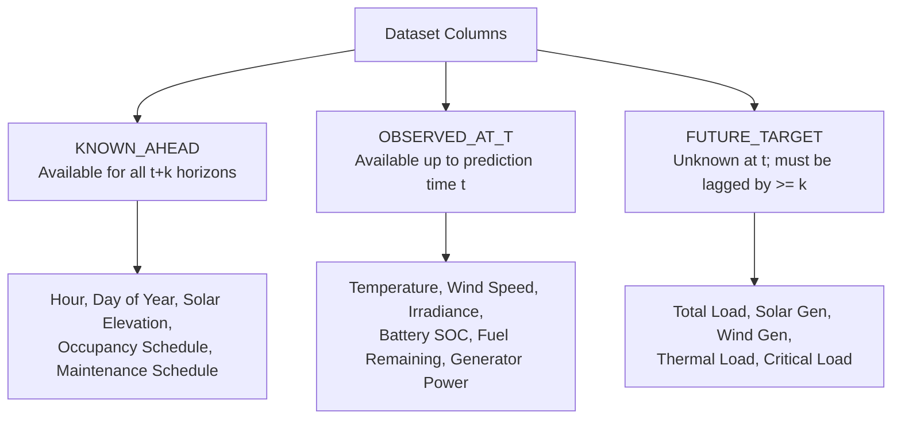

# Polaris-EMS: Feature Availability & Leakage Prevention Matrix
**SIH Problem Statement**: SIH26061 — AI-Driven Smart Energy Management System for Polar Research Stations  
**Status**: Authoritative ML Contract (Phase 2 Deliverable)  

---

## 1. Feature Availability Taxonomy

To prevent data leakage during Phase 3 ML forecasting, every column in the Polaris-EMS synthetic environment is strictly classified by its availability at prediction time $t$:

### Taxonomy Definitions:
1. **`KNOWN_AHEAD`**: Variables derived deterministically from the calendar, astronomical geometry, or published operational shifts. These can be included as direct feature inputs across future forecast horizons $t+k$ ($k \in [1, 168]$).
2. **`OBSERVED_AT_T`**: Environmental and telemetry variables measured by station sensors up to timestep $t$. For a forecast at horizon $t+k$, these variables may only enter the feature matrix as lag features ($t, t-1, t-24$, etc.) or via external weather forecast services (NCPOR/ECMWF forecasts).
3. **`FUTURE_TARGET_UNKNOWN_AT_T`**: The forecasting targets (e.g. electrical demand, PV yield, wind yield). To prevent future leakage, a target variable may NEVER enter a model feature set for step $t+k$ unless strictly lagged by $\ge k$ hours.

---

## 2. Complete Feature Availability Matrix

| Feature Name | Category | Available at $t+k$? | Requires Lag $\ge k$? | Is Target? | Notes / Usage in Phase 3 ML |
| :--- | :--- | :--- | :--- | :--- | :--- |
| **`timestamp`** | `KNOWN_AHEAD` | Yes | No | No | Base time index. |
| **`station_id`** | `KNOWN_AHEAD` | Yes | No | No | Categorical station encoding. |
| **`solar_elevation_deg`** | `KNOWN_AHEAD` | Yes | No | No | Astronomical solar position; excellent predictor for solar potential. |
| **`occupancy_state`** | `KNOWN_AHEAD` | Yes | No | No | Station operational schedule; known in advance. |
| **`maintenance_state`** | `KNOWN_AHEAD` | Yes | No | No | Planned generator/HVAC maintenance windows. |
| **`temperature_c`** | `OBSERVED_AT_T` | No | Yes | No | Measured at $t$. Future steps require weather forecast input or autoregressive lag. |
| **`pressure_hpa`** | `OBSERVED_AT_T` | No | Yes | No | Measured at $t$. Barometric trend indicates impending storm fronts. |
| **`humidity_pct`** | `OBSERVED_AT_T` | No | Yes | No | Measured at $t$. |
| **`wind_speed_ms`** | `OBSERVED_AT_T` | No | Yes | No | Measured at $t$. Future steps require weather forecast input or autoregressive lag. |
| **`wind_direction_deg`** | `OBSERVED_AT_T` | No | Yes | No | Measured at $t$. Directional wind vector components ($\sin/\cos$). |
| **`irradiance_wm2`** | `OBSERVED_AT_T` | No | Yes | No | Measured at $t$. Attenuated by clouds; future steps require forecast or clear-sky proxy. |
| **`cloud_fraction`** | `OBSERVED_AT_T` | No | Yes | No | Measured at $t$. Cloud cover forecast inputs. |
| **`battery_soc_pct`** | `OBSERVED_AT_T` | No | Yes | No | Current energy storage state. |
| **`battery_energy_kwh`** | `OBSERVED_AT_T` | No | Yes | No | Current energy stored. |
| **`battery_temperature_derating`**| `OBSERVED_AT_T`| No| Yes | No | Electrochemical derate factor. |
| **`generator_power_kw`** | `OBSERVED_AT_T` | No | Yes | No | Current generator output. |
| **`fuel_remaining_l`** | `OBSERVED_AT_T` | No | Yes | No | Remaining fuel in tank farm. |
| **`total_load_kw`** | `FUTURE_TARGET` | No | **Yes ($\ge k$)** | **YES** | **Primary target for Engine 1 Load Forecaster**. |
| **`thermal_load_kw`** | `FUTURE_TARGET` | No | **Yes ($\ge k$)** | **YES** | Physics-informed load decomposition component. |
| **`critical_load_kw`** | `FUTURE_TARGET` | No | **Yes ($\ge k$)** | **YES** | Non-deferrable load component. |
| **`solar_generation_kw`** | `FUTURE_TARGET` | No | **Yes ($\ge k$)** | **YES** | **Primary target for Engine 1 Solar Forecaster**. |
| **`wind_generation_kw`** | `FUTURE_TARGET` | No | **Yes ($\ge k$)** | **YES** | **Primary target for Engine 1 Wind Forecaster**. |

---

## 3. Strict Audit Verification

The automated script [`leakage_auditor.py`](file:///c:/Users/Charan%20B/OneDrive/Desktop/polaris/backend/data/synthetic/leakage_auditor.py) programmatically inspects all generated datasets before saving to disk:
- Enforces strict chronological monotonicity.
- Confirms zero centered rolling windows ($\text{center}=\text{True}$ is forbidden).
- Verifies that target variables do not possess zero-variance trivial signals.
