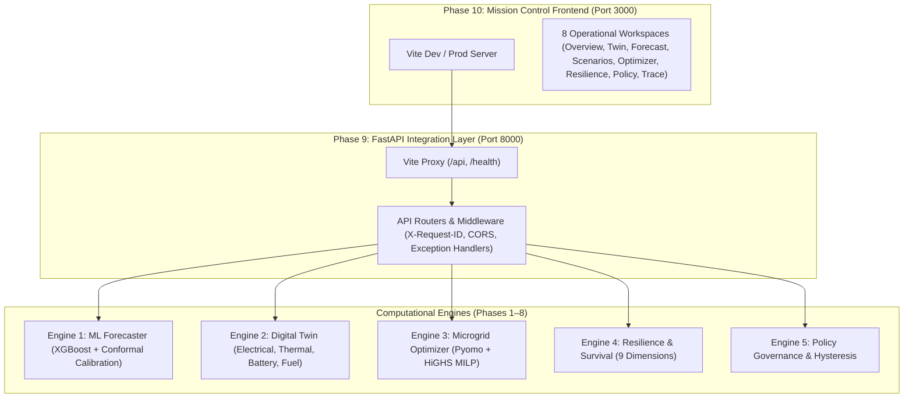

# Polaris-EMS: Phase 10 Production Integration & Walkthrough
**SIH Problem Statement**: SIH26061 — AI-Driven Smart Energy Management System for Polar Research Stations  
**System Status**: 🟢 **PHASE 10 FROZEN — Production Build & Local Runtime Integration Verified**  
**Target Fleet**: Bharati Station (69°S), Maitri Station (70°S), Himadri Station (79°N)  
**Verification Environment**: Local Integrated Runtime (Vite Proxy on `127.0.0.1:3000` $\to$ FastAPI on `127.0.0.1:8000`). No remote deployment claimed.

---

## 1. Executive Summary

Phase 10 represents the visual, architectural, and runtime production integration freeze of **Polaris-EMS**. It integrates all computational engines (Phases 1–8) with the FastAPI integration layer (Phase 9) and the mission-control React frontend into a unified microgrid resilience system.

### Verified Implementation Facts:
- **100% Audit Gate Pass**: All **13/13** runtime, provenance, and domain error gates verified cleanly via [verify_phase10_runtime.py](file:///c:/Users/Charan%20B/OneDrive/Desktop/polaris/scripts/verify_phase10_runtime.py) through the live Vite reverse proxy.
- **100% Frontend Test Suite**: All **12/12** tests passing in Vitest ([api.test.ts](file:///c:/Users/Charan%20B/OneDrive/Desktop/polaris/frontend/src/test/api.test.ts) & [components.test.tsx](file:///c:/Users/Charan%20B/OneDrive/Desktop/polaris/frontend/src/test/components.test.tsx)).
- **100% Full Backend Regression Suite**: All **206/206** tests passing in Pytest across all modules.
- **Production Build Clean**: TypeScript typechecking and Vite production bundling ([`frontend/dist/`](file:///c:/Users/Charan%20B/OneDrive/Desktop/polaris/frontend/dist)) compile with zero errors.
- **Strict Provenance Enforcement**: Absolute 6-tier provenance taxonomy compliance with zero fabricated 7th tiers (`REAL`, `CONFIGURED`, `ASSUMED`, `SYNTHETIC`, `FORECAST`, `SIMULATED`).

---

## 2. End-to-End System Architecture



---

## 3. The 8 Operational Mission-Control Workspaces

Polaris-EMS features eight dedicated operational workspaces engineered for station operators, electrical officers, and station commanders:

### 1. Fleet & Station Overview ([OverviewView.tsx](file:///c:/Users/Charan%20B/OneDrive/Desktop/polaris/frontend/src/views/OverviewView.tsx))
- **Dynamic Fleet Telemetry**: Live station switching between **Bharati** (240 kW aggregate diesel, 3 gensets), **Maitri** (187.5 kW, 3 gensets), and **Himadri** (90 kW, 2 gensets) with zero frontend hardcoding.
- **System Health & Resilience Matrix**: Immediate visibility of composite resilience score, operational policy directives, and active threat warnings.
- **Subsystem Telemetry Badges**: High-contrast, WCAG-compliant status badges with explicit state text (`SAFE`, `WATCH`, `THREATENED`, `CRITICAL`).

### 2. Probabilistic Forecast Explorer ([ForecastView.tsx](file:///c:/Users/Charan%20B/OneDrive/Desktop/polaris/frontend/src/views/ForecastView.tsx))
- **Multi-Target Forecasting**: On-demand conformal quantile predictions ($P_{10}, P_{50}, P_{80}, P_{90}, P_{95}$) for:
  - Station electrical demand (`total_load_kw`)
  - Solar generation potential (`solar_generation_kw`)
  - Wind turbine production (`wind_generation_kw`)
- **Horizon Switching**: Seamless toggle between **48h tactical operational horizon** and **168h strategic weekly horizon**.
- **Physics-Informed Bounds**: Load decomposition separating baseline thermal losses from human-driven scientific loads.

### 3. Computational Energy Digital Twin ([EnergyTwinView.tsx](file:///c:/Users/Charan%20B/OneDrive/Desktop/polaris/frontend/src/views/EnergyTwinView.tsx))
- **Subsystem Coupled Simulation**: 4-domain continuous physics simulation:
  - **Electrical**: Power balance, bus voltage stability, and unserved energy accounting.
  - **Thermal**: First-principles building heat loss and indoor temperature envelope.
  - **Battery**: Electrochemical state-of-charge (SOC), cold-temperature capacity derating, and anti-churn rules.
  - **Diesel Fuel**: Non-linear generator fuel curves and day-tank depletion tracking.
- **Deficit Accounting**: Transparent reporting of unserved energy with `SIMULATED` provenance.

### 4. Stress Scenario & What-If Studio ([ScenariosView.tsx](file:///c:/Users/Charan%20B/OneDrive/Desktop/polaris/frontend/src/views/ScenariosView.tsx))
- **14 Authoritative Locked Polar Scenarios ([ScenarioRegistry](file:///c:/Users/Charan%20B/OneDrive/Desktop/polaris/backend/scenarios/registry.py))**:
  1. `NORMAL_BASELINE` — Unperturbed reference simulation trajectory under standard forecast conditions.
  2. `CLOUDY_CONDITIONS` — Elevated cloud attenuation factor (1.5x) reducing solar PV.
  3. `HEAVY_CLOUD_LOW_IRRADIANCE` — Dense overcast cloud deck reducing solar irradiance by 75%.
  4. `HIGH_WIND` — Katabatic surge (1.4x wind speed) testing turbine aerodynamic limits.
  5. `BLIZZARD` — Coupled polar storm: -10°C temperature depression, gale wind cut-out risk, and zero solar.
  6. `EXTREME_COLD` — Mid-winter vortex plunge (-20°C drop) testing heating habitability & battery derating.
  7. `LOW_DAYLIGHT` — Heavy atmospheric scattering reducing daylight opportunity.
  8. `POLAR_NIGHT` — Astronomical continuous winter polar night with zero solar irradiance.
  9. `SOLAR_GENERATION_FAILURE` — Inverter hardware breaker trip; complete loss of solar PV generation.
  10. `WIND_GENERATION_FAILURE` — Wind turbine pitch actuator mechanical jam; mechanical shutdown.
  11. `BATTERY_DEGRADATION` — Electrochemical cell capacity degradation (65% usable capacity).
  12. `FUEL_RESUPPLY_DELAY` — Resupply convoy delayed by 7 days (+168h) due to coastal sea-ice blockage.
  13. `COMBINED_POLAR_STRESS` — Compound disaster combining extreme cold, blizzard, renewable trip, and resupply delay.
  14. `CUSTOM` — User-defined parameter exploration with interactive overrides.
- **Comparative Impact Matrix**: Immediate delta computations against baseline for unserved energy ($\Delta \text{kWh}$), excess diesel consumed ($\Delta \text{Liters}$), and minimum battery SOC reached.

### 5. Microgrid Optimizer Dispatch ([OptimizationView.tsx](file:///c:/Users/Charan%20B/OneDrive/Desktop/polaris/frontend/src/views/OptimizationView.tsx))
- **HiGHS Rolling MILP**: Rigorous mixed-integer linear programming dispatch with verified solver optimality tiers (`EXACT_OPTIMAL` or `MIP_GAP_OPTIMAL`).
- **3 Optimization Modes**:
  - `EXPECTED`: Cost-optimal dispatch under median $P_{50}$ forecasts.
  - `CONSERVATIVE`: Risk-averse dispatch hedging against $P_{90}$ load peaks and $P_{10}$ renewable drops.
  - `SCENARIO_ROBUST`: Multi-scenario robust dispatch satisfying worst-case contingencies.
- **Closed-Loop Twin Replay**: Every optimizer schedule is re-simulated in the Digital Twin to verify physical feasibility before dispatch approval.

### 6. Resilience & Survival Horizon Assessment ([ResilienceView.tsx](file:///c:/Users/Charan%20B/OneDrive/Desktop/polaris/frontend/src/views/ResilienceView.tsx))
- **9 Quantitative Dimensions**: Radar breakdown spanning Energy Adequacy, Critical Load Resilience, Thermal Resilience, Generation Headroom, Storage Health, Fuel Endurance, Logistics Buffer, Renewable Penetration, and Recovery Potential.
- **Subsystem Survival Horizons**: Independent calculation of hours until failure:
  - Battery endurance horizon ($h$)
  - Thermal habitability horizon ($h$)
  - Fuel exhaustion horizon ($h$)
  - Critical load survival horizon ($h$)
- **Advisory Recovery Pathways**: Automated generation of prioritized, actionable operator recovery interventions (e.g., non-critical load shedding, generator pre-warming). Zero frontend re-ranking; strict backend priority preserved.

### 7. Operational Policy & Governance ([PolicyView.tsx](file:///c:/Users/Charan%20B/OneDrive/Desktop/polaris/frontend/src/views/PolicyView.tsx))
- **Authoritative 8-Level Priority Hierarchy ([PolicyPriorityEnum](file:///c:/Users/Charan%20B/OneDrive/Desktop/polaris/backend/policy/schema.py#L46-L59))**:
  - **P1 — Critical Life Safety**: Station habitation & essential life-support power.
  - **P2 — Critical Load Protection**: Freeze protection heat-tracing, water pumping, emergency satcoms.
  - **P3 — Generation Reserve Protection**: Standby genset readiness when operating margin drops below thresholds.
  - **P4 — Thermal Safety**: Building thermal envelope protection & space heating prioritization.
  - **P5 — Fuel / Resupply Protection**: Day-tank preservation & strategic stock rationing under logistics delay.
  - **P6 — Storage Protection**: Battery SOC minimum reserve cutoff & cold-temperature derating defense.
  - **P7 — Noncritical Optimization / Recovery Stabilization**: Discretionary load curtailment & stabilization.
  - **P8 — Monitoring**: Supervisory telemetry observation under nominal unthreatened operations.
- **Hysteresis Deadbands**: Stateful prevention of rapid cycling (anti-chattering) on generator start/stop and load shedding triggers.

### 8. End-to-End Decision Trace ([DecisionTraceView.tsx](file:///c:/Users/Charan%20B/OneDrive/Desktop/polaris/frontend/src/views/DecisionTraceView.tsx))
- **"Why did Polaris-EMS do this?"**: Complete transparent audit trail from raw telemetry input, through forecast quantiles and scenario stress transforms, to solver constraints and final operational policy decisions.
- **Stage Execution Profiler**: Granular latency measurements across all pipeline stages with full request correlation tracking (`X-Request-ID`).

---

## 4. Phase 10 Runtime Freeze Audit Results

Ran live against `http://127.0.0.1:3000` via [verify_phase10_runtime.py](file:///c:/Users/Charan%20B/OneDrive/Desktop/polaris/scripts/verify_phase10_runtime.py):

| Gate # | Audit Gate Description | Target Endpoint | Result | Verified Metric / Detail |
| :---: | :--- | :--- | :---: | :--- |
| **1** | System Readiness Probe | `GET /health/ready` | **PASS** | `BHARATI`, `MAITRI`, `HIMADRI` loaded; prov=`CONFIGURED` |
| **2** | Station Catalog Discovery | `GET /api/v1/stations` | **PASS** | 3 stations returned with full specs |
| **3** | Dynamic Fleet Specifications | `GET /api/v1/stations/{id}` | **PASS** | Bharati (240kW/3 gensets), Maitri (187.5kW/3 gensets), Himadri (90kW/2 gensets) |
| **4** | Multi-Target Forecasting (48h) | `POST /api/v1/forecast` | **PASS** | `total_load_kw`, `solar_generation_kw`, `wind_generation_kw` calibrated quantiles |
| **5** | Strategic Horizon Switch (168h)| `POST /api/v1/forecast` | **PASS** | 168 hourly predictions returned with zero missing intervals |
| **6** | Scenario Catalog Inspection | `GET /api/v1/scenarios` | **PASS** | 14 locked polar stress presets loaded |
| **7** | Live Blizzard Stress Test | `POST /api/v1/scenarios/evaluate` | **PASS** | Delta Unserved: `0.0 kWh`, Delta Fuel: `190.74 L` |
| **8a**| Optimizer Dispatch (EXPECTED) | `POST /api/v1/optimize` | **PASS** | Status `OPTIMAL`, tier `MIP_GAP_OPTIMAL`, relative gap `0.02997` |
| **8b**| Optimizer Dispatch (CONSERVATIVE)| `POST /api/v1/optimize` | **PASS** | Status `OPTIMAL`, tier `MIP_GAP_OPTIMAL`, relative gap `0.02998` |
| **8c**| Optimizer Dispatch (SCENARIO_ROBUST)| `POST /api/v1/optimize` | **PASS** | Status `OPTIMAL`, tier `MIP_GAP_OPTIMAL`, relative gap `0.02997` |
| **9** | 9-Dimension Resilience Assessment| `POST /api/v1/resilience/evaluate` | **PASS** | State `THREATENED`, Composite `0.90`, Advisory Options verified |
| **10**| Policy Governance & Hysteresis | `POST /api/v1/policy/evaluate` | **PASS** | State `MITIGATE`, Directive `BLOCK_DISCRETIONARY_LOADS` |
| **11**| Unified Decision Trace Pipeline| `POST /api/v1/pipeline/analyze` | **PASS** | 6 stages completed, overall status `SUCCESS` |
| **12**| Domain 404 Error Contract | `GET /api/v1/stations/INVALID` | **PASS** | Code `STATION_NOT_FOUND`, message matched, correlation ID |
| **13**| Domain 422 Error Contract | `POST /api/v1/forecast` (invalid) | **PASS** | Code `VALIDATION_ERROR`, Pydantic parameter error captured |

---

## 5. Strict 6-Tier Provenance Taxonomy

Every single metric, card, table, and chart in the user interface renders an explicit provenance tag to prevent misinterpreting synthetic or simulated values for physical sensor readings:

```
[REAL]        -> Verified NCPOR AWS / NPDC polar research station telemetry
[CONFIGURED]  -> Manufacturer nameplate ratings, fuel tank sizes, generator ratings
[ASSUMED]     -> Stated engineering approximations (building heat transfer U-values)
[SYNTHETIC]   -> Physics-informed base environment generation
[FORECAST]    -> Calibrated ML model quantiles (P10, P50, P80, P90, P95)
[SIMULATED]   -> Digital Twin continuous simulation & optimizer dispatch trajectories
```

> [!IMPORTANT]
> The codebase enforces an architectural boundary prohibiting fabricated 7th tiers (`LIVE`, `REAL-TIME`, `OPTIMIZED`, `API`). Any such tag triggers lint, test, and validation failure.

---

## 6. Runtime Incident Investigation & Classification

1. **WinError 10061 Connection Refusal**:
   - *Cause*: Vite on Node/Windows bound `localhost` exclusively to IPv6 `::1`, while Python client connected to `127.0.0.1`.
   - *Resolution*: Configured `host: '127.0.0.1'` in `frontend/vite.config.ts`.
   - *Classification*: Resolved configuration setting; verified non-reproducible.
2. **Transient IDE Stream TCP Disconnection**:
   - *Cause*: IDE upstream connection reset (`write tcp ... wsasend: An existing connection was forcibly closed by the remote host`).
   - *Classification*: Non-application environment incident; non-blocking.
3. **Audit Client Socket Timeout Under Concurrent Load**:
   - *Cause*: Client socket timeout (45s) was too tight during simultaneous execution of full 206-test pytest regression suite and 48h HiGHS MILP optimization. Server returned HTTP 200 shortly after.
   - *Resolution*: Increased client socket timeout in audit script to 120s.
   - *Classification*: Non-blocking client configuration adjustment; re-verified 13/13 passing with zero errors.

---

## 7. How to Run Locally

### Start Backend Services
```bash
# 1. Activate Python virtual environment
.venv\Scripts\activate

# 2. Start FastAPI application
python -m uvicorn backend.api.app:app --host 127.0.0.1 --port 8000
```

### Start Frontend Mission Control
```bash
# 1. Navigate to frontend
cd frontend

# 2. Launch Vite dev server
npm run dev
# Interface opens at http://127.0.0.1:3000
```

### Run Verification Suites
```bash
# 1. Run Full Backend Regression Suite (206 tests)
pytest tests/ -v

# 2. Run Frontend Vitest Suite (12 tests)
cd frontend && npm test

# 3. Compile Production Bundle (0 errors)
cd frontend && npm run build

# 4. Run Complete Phase 10 Runtime Freeze Audit (13 gates)
python scripts/verify_phase10_runtime.py
```
