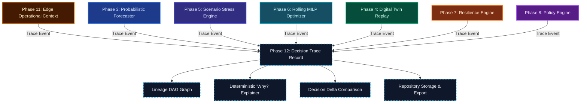

# Polaris-EMS: Phase 12 Architecture Specification
## Decision Trace, Explainability & End-to-End Auditability Layer

**SIH Problem Statement**: SIH26061 — AI-Driven Smart Energy Management System for Polar Research Stations  
**Phase**: Phase 12 (Decision Trace & Auditability)  
**Status**: COMPLETE & READY FOR FREEZE  
**Core Mandate**: Build an observational audit, lineage, and explainability layer over existing decision engines (Phases 3–11) to answer: *What did the system decide? Why? Based on what evidence? What was physically validated vs. estimated? What policy applied? What changed from previous decisions?*

---

## 1. Architectural Philosophy & Pure Observation Invariant

Phase 12 is strictly an **observational audit layer**. It does **not** become an authoritative decision engine.

### Frozen Ownership Boundaries
| Authority | Phase | Mathematical & Physical Invariant |
| :--- | :--- | :--- |
| **Forecasting Authority** | Phase 3 ML | Probabilistic load, solar, wind inference with calibrated conformal intervals. Zero forecasting logic in Phase 12. |
| **Physical Authority** | Phase 4 Digital Twin | High-fidelity power balance, battery electrochemistry, thermal equations, generator curves. Zero physics equations in Phase 12. |
| **Stress-Testing Authority** | Phase 5 Scenario Engine | Authoritative `ScenarioRegistry` hazard transforms. Zero secondary transformations in Phase 12. |
| **Dispatch Authority** | Phase 6 Optimizer | Sole optimizer ($P_6$ Pyomo + HiGHS rolling MILP). **Zero Pyomo models, zero HiGHS calls in Phase 12.** |
| **Resilience Authority** | Phase 7 Resilience Engine | 9-dimensional resilience assessment, survival horizons, recovery intelligence. Zero re-scoring in Phase 12. |
| **Governance Authority** | Phase 8 Policy Engine | $P_1\text{–}P_8$ priority hierarchy, stateful hysteresis deadband. Zero policy rules in Phase 12. |
| **Integration Authority** | Phase 9 API | REST contracts, endpoints, schemas, structured errors. |
| **Presentation Authority** | Phase 10 Frontend | Mission control UI workspaces, charts, telemetry widgets. |
| **Edge Operational Authority** | Phase 11 Edge | Local telemetry buffer, data quality validation, device health, disconnected fallback. |
| **Audit & Explainability** | **Phase 12 Trace** | **Observes, links, explains, compares, persists, and exports existing engine outputs.** |

---

## 2. Core Concepts & Data Contracts

### 2.1 Decision Trace ID (`decision_trace_id`)
Globally identifiable, machine-readable, human-readable format:
`DT-{YYYYMMDD}-{STATION}-{RANDOM_HEX_6}`
*Example*: `DT-20260924-BHARATI-BFEC1E`

### 2.2 Trace Execution Lifecycle States
Deterministic 8-state execution lifecycle:
- `CREATED`: Trace initialized and metadata attached.
- `RUNNING`: Pipeline analysis stages currently active.
- `COMPLETED`: All stages executed and verified without downstream failure.
- `PARTIAL`: Early stage results available, but downstream stage was unavailable or skipped.
- `BLOCKED`: Upstream governance (Phase 8 Policy) halted pipeline progression.
- `INFEASIBLE`: Phase 6 optimizer reported mathematical infeasibility.
- `FALLBACK`: Edge offline posture or optimizer fallback heuristic was engaged.
- `FAILED`: Critical downstream stage execution encountered an unrecoverable error.

### 2.3 Epistemic Validation Tiers
Explicit validation distinctions prevent operational ambiguity:
- `REQUESTED`: Operator or scenario request parameters.
- `COMPUTED`: Phase 3 ML predictions or Phase 6 optimizer-proposed schedules.
- `SIMULATED`: Scenario-projected hazard profiles.
- `VALIDATED`: Phase 4 Digital Twin verified power balance and physical feasibility.
- `ESTIMATED`: Phase 7 projected recovery horizons (carry estimated status until physical confirmation).
- `ADVISORY`: Phase 8 policy governance directives.

### 2.4 Frozen Six-Tier Provenance Taxonomy
No 7th tier permitted:
1. `REAL`
2. `CONFIGURED`
3. `ASSUMED`
4. `SYNTHETIC`
5. `FORECAST`
6. `SIMULATED`

---

## 3. Decision Lineage DAG & Terminal Identification

Each `TraceEvent` contains `event_id`, `trace_id`, `stage`, `parent_event_id`, `status`, and `reason_code`.
The `LineageGraphBuilder` constructs a directed acyclic graph (DAG) representation:

$$\text{DAG} = (\mathcal{V}, \mathcal{E}), \quad \mathcal{V} = \{e_1, e_2, \dots, e_n\}, \quad \mathcal{E} = \{(e_i, e_j) \mid e_j.\text{parent\_event\_id} = e_i.\text{event\_id}\}$$

### Terminal Event Logic
The terminal event represents the final decisive action or the exact failure/blocking boundary:
1. If any event has status $\in \{\text{FAILED}, \text{BLOCKED}, \text{FALLBACK}\}$, the first non-nominal event is identified as the terminal node.
2. If all stages completed nominally, the final governance event (`POLICY`) is the terminal node.
3. No artificial downstream events are ever fabricated if execution is halted prematurely.

---

## 4. Deterministic Explainability Layer

Located in `backend/trace/explainer.py`, the `DeterministicExplainer` formats structured engine outputs into unambiguous natural language without an LLM.

### Questions Answered by the "Why?" View
1. **WHY THIS STATE?**: Factual resilience index, binding subsystem, and survival horizon evaluated by Phase 7.
2. **WHY THIS POLICY?**: Direct governance rule trigger, $P_1\text{–}P_8$ priority adherence, and hysteresis deadband status from Phase 8.
3. **WHY THIS SCHEDULE?**: Exact solver status, relative MIP gap ($0.02997$), and objective value from Phase 6.
4. **WHAT DATA WAS USED?**: Factual inputs, model registry version, horizon, and weather context from Phase 3.
5. **WHAT WAS VALIDATED?**: Digital Twin power balance and thermal continuity replay outcomes from Phase 4.
6. **WHAT REMAINS ESTIMATED?**: Long-term survival projections and recovery options from Phase 7.
7. **WHAT IS NEXT?**: Clear, actionable operational handoff recommendation.

---

## 5. Comparative Decision Delta (Before vs. After)

Located in `backend/trace/comparison.py`, the `TraceComparisonEngine` computes factual differentials between any two decision traces:
- **State Transitions**: $(\text{State}_{\text{base}} \to \text{State}_{\text{compare}})$ for Policy, Resilience, Edge, and Solver Status.
- **Numerical Deltas**: $\Delta \text{Objective}$, $\Delta \text{Fuel}$, $\Delta \text{Unserved Load}$, $\Delta \text{Resilience Index}$.
- **Summary Narrative**: Factual comparative explanation without evaluative bias.

---

## 6. Persistence & Bounded Retention

Located in `backend/trace/repository.py`, the `TraceRepository` implements a reliable local storage architecture:
- **Storage Location**: `reports/traces/<station_id>/<trace_id>.json`
- **Memory Cache**: LRU in-memory index for sub-millisecond retrieval.
- **Bounded Retention**: Default capacity of 500 traces per station with automatic rotation.
- **Multi-Format Export**: Full JSON export and standard tabular CSV export.
- **No Heavy Infrastructure**: Pure Python + file system, fully swappable for production time-series databases.

---

## 7. API Routing & Contracts

Mounted under `/api/v1/traces`:
- `GET /api/v1/traces`: List traces with filters (`station_id`, `status`, `policy_state`, `resilience_state`, `limit`).
- `GET /api/v1/traces/{trace_id}`: Full `TraceRecord` with events and lineage graph.
- `GET /api/v1/traces/{trace_id}/events`: List of atomic `TraceEvent` objects.
- `GET /api/v1/traces/{trace_id}/summary`: High-level `TraceSummary`.
- `GET /api/v1/traces/{trace_id}/explanation`: Deterministic `DecisionExplanation`.
- `GET /api/v1/traces/{base_id}/compare/{compare_id}`: `DecisionDelta` comparison report.
- `GET /api/v1/traces/{trace_id}/export`: Formatted export (`?format=json` or `?format=csv`).

---

## 8. Frontend Decision Trace Workspace

Expanded in `frontend/src/views/DecisionTraceView.tsx`:
- **Trace History Selector**: Dropdown to review past executions and live status badges.
- **Sequential Stage Timeline**: Stepper displaying durations, reason codes, validation tiers, and provenance tags.
- **Lineage DAG Visualization**: Parent-to-child flow with terminal node highlight.
- **Detailed Evidence Inspector**: Subsystem-specific outputs and inputs.
- **"Why?" Explanation Panel**: 6 structured cards answering the core audit questions.
- **Decision Delta Comparison View**: Interactive side-by-side transition table and metric diffs.
- **Export Trigger**: One-click download of JSON and CSV audit records.
