# Polaris-EMS: Phase 13 Architecture Specification
## Scientific Validation, Benchmarking, Model Explainability & Reproducibility

**SIH Problem Statement**: SIH26061 — AI-Driven Smart Energy Management System for Polar Research Stations  
**Phase**: Phase 13 (Validation, Benchmarking, Explainability & Reproducibility Authority)  
**System Status**: 🟢 **PHASE 13 IMPLEMENTED & READY FOR VALIDATION**  

---

## 1. Architectural Philosophy & Non-Interference Invariants

Phase 13 establishes the scientific observational authority for the Polaris-EMS platform. It operates strictly as an independent evaluator and benchmarker, adhering to the following structural boundaries:

1. **Zero New Mathematical Solvers**: No Pyomo models, HiGHS solvers, or LP/MIP formulations exist in Phase 13. Phase 6 remains the sole optimization authority.
2. **Zero New Microgrid Physics Equations**: Electrical power balance, building envelope thermodynamics, electrochemical battery degradation, and generator fuel curves remain strictly isolated within Phase 4 Digital Twin.
3. **Zero Retraining or Weight Mutation**: Phase 13 observes trained Phase 3 models as immutable artifacts; no retraining or threshold softening is performed.
4. **Zero Governance Intrusion**: Operational policies and life-safety priority hierarchies remain strictly governed by Phase 8.
5. **Strict 6-Tier Provenance Taxonomy**: All outputs are classified under `REAL`, `CONFIGURED`, `ASSUMED`, `SYNTHETIC`, `FORECAST`, or `SIMULATED`.

```
┌─────────────────────────────────────────────────────────────────────────────┐
│                       POLARIS-EMS ARCHITECTURAL AUTHORITY                   │
├─────────────────────┬───────────────────────────────────────────────────────┤
│ Phase 3             │ ML Forecasting Authority                              │
│ Phase 4             │ Digital Twin / Physical Authority                     │
│ Phase 5             │ Scenario / Stress Testing Authority                   │
│ Phase 6             │ Sole Microgrid Optimization Authority                 │
│ Phase 7             │ Resilience Assessment Authority                       │
│ Phase 8             │ Operational Policy Governance Authority               │
│ Phase 9             │ REST API Integration Authority                        │
│ Phase 10            │ Mission Control Frontend Authority                    │
│ Phase 11            │ Edge / Device / Connectivity Authority                │
│ Phase 12            │ Decision Trace & Auditability Authority               │
│ Phase 13            │ Scientific Validation, Benchmarking & Reproducibility │
└─────────────────────┴───────────────────────────────────────────────────────┘
```

---

## 2. Core Validation Subsystems

```mermaid
flowchart TD
    subgraph VAL ["Phase 13 Validation & Benchmarking Authority"]
        FV["ForecastValidator<br/>(Metrics, Baselines, Calibrations, Regimes)"]
        LK["LeakageAuditor<br/>(Chronological Splits & Causality Proof)"]
        EXP["ModelExplainer<br/>(Native Tree SHAP pred_contribs)"]
        OPT["OptimizerBenchmark<br/>(Fair Dispatch Matrix & Twin Replay)"]
        RES["ResilienceValidator<br/>(Stress Progression & 5 Invariants)"]
        EDG["EdgeValidator<br/>(7 Degradation Modes & Offline Safety)"]
        REP["ReplayRunner<br/>(Closed-Loop Decision Trace Reproduction)"]
        ARC["TraceArchive<br/>(Compressed Cold Storage Store)"]
        PRF["PerformanceBenchmark<br/>(Latency & Resource Profiler)"]
        EVD["SIHEvidenceEngine<br/>(Consolidated Scientific Evidence)"]
    end

    subgraph FROZEN ["Frozen Computational Authorities (Phases 1–12)"]
        P3["Phase 3: ModelRegistry"]
        P4["Phase 4: TwinEngine"]
        P5["Phase 5: ScenarioRegistry"]
        P6["Phase 6: OptimizerEngine"]
        P7["Phase 7: ResilienceEngine"]
        P8["Phase 8: PolicyEngine"]
        P11["Phase 11: EdgeStateManager"]
        P12["Phase 12: TraceRepository"]
    end

    FV --> P3
    LK --> P3
    EXP --> P3
    OPT --> P6
    OPT --> P4
    RES --> P7
    RES --> P4
    EDG --> P11
    REP --> P12
    REP --> P3
    REP --> P6
    REP --> P4
    REP --> P7
    REP --> P8
    ARC --> P12
    EVD --> FV
    EVD --> OPT
    EVD --> RES
    EVD --> EDG
    EVD --> REP
```



---

## 3. Detailed Component Architecture

### A. ML Forecast Validator (`backend/validation/forecast_validator.py`)
- **Point Accuracy**: Evaluates Mean Absolute Error (MAE), Root Mean Squared Error (RMSE), Symmetric Mean Absolute Percentage Error (sMAPE), Coefficient of Determination ($R^2$), and Mean Bias Error (MBE) across 3 polar stations and 6 horizons (1h, 6h, 12h, 24h, 48h, 168h).
- **Baselines**: Standardized benchmark comparison against 4 standard reference models:
  1. `PERSISTENCE`: Naive $y_{t+k} = y_t$
  2. `SEASONAL_NAIVE`: Diurnal 24h periodic repetition $y_{t+k} = y_{t+k-24}$
  3. `RIDGE`: L2-regularized linear baseline
  4. `RANDOM_FOREST`: Uncalibrated ensemble of regression trees
- **Conformal Uncertainty Calibration**: Evaluates empirical coverage of quantiles $P_{10}, P_{50}, P_{90}, P_{95}$, interval sharpness (width in kW), and verifies zero quantile crossings across the nominal 80% central prediction interval $[P_{10}, P_{90}]$.
- **Disturbance Regimes**: Evaluates degradation ratios under canonical polar disturbance conditions (Cloud surge, Blizzard, High wind, Low daylight, Extreme cold, Combined polar stress).

### B. Formal Data Leakage & Causality Auditor (`scripts/verify_phase13_leakage.py`)
- Verifies chronological separation: Train (60%) < Calibration (15%) < Test (25%).
- Enforces strict autoregressive lag formulation: all target lags evaluate $t - k$ ($k \ge 0$).
- Enforces zero future target leakage and zero forward weather leakage at forecast origin $t_0$.

### C. Native Tree SHAP Model Explainability (`backend/validation/explainability.py`)
- Employs XGBoost's native `booster.predict(dmat, pred_contribs=True)` implementing the Tree SHAP polynomial-time algorithm.
- Formally validates exact Shapley additivity proof:
  $$\sum_{i=1}^M \phi_i(x) + \phi_0 = f(x)$$
- Enforces non-causal labeling: strictly designated as `MODEL CONTRIBUTION ONLY — NOT PHYSICAL CAUSATION`.
- Provides deterministic ranking of feature drivers for station operators.

### D. Fair Microgrid Optimizer Benchmarker (`backend/validation/optimizer_benchmark.py`)
- Benchmarks candidate optimizer schedules (`EXPECTED`, `CONSERVATIVE`, `SCENARIO_ROBUST`) against `BASELINE_SIMULATION_DISPATCH` under strictly identical initial physical state and scenario trajectories.
- Validates every candidate schedule through closed-loop Phase 4 Digital Twin replay to verify physical admissibility before dispatch approval.
- Distinguishes mathematical solver optimality tiers: `EXACT_OPTIMAL` vs `MIP_GAP_OPTIMAL` (< 1.5% relative optimality gap).

### E. Resilience Stress & Physical Invariant Validator (`backend/validation/resilience_validator.py`)
- Validates resilience state progression under escalating polar storm sequences.
- Formally verifies 5 foundational physical/logical invariants:
  1. Generator capacity reduction never increases available capacity.
  2. Elevated load demand never decreases required power.
  3. Zero solar irradiance never increases renewable generation.
  4. Battery cell degradation never increases usable kWh storage.
  5. Logistics resupply delay never moves resupply earlier.

### F. Edge Degradation & Offline Safety Validator (`backend/validation/edge_validator.py`)
- Tests system behavior across 7 canonical degraded field conditions: `NORMAL`, `DEVICE_STALE`, `DEVICE_FAILURE`, `CONNECTIVITY_DEGRADED`, `CONNECTIVITY_OFFLINE`, `BUFFER_GROWTH`, `RECONNECT`.
- **Offline Safety Proof**: Proves that when central communications are unavailable, zero central solvers are called (`central_solver_invoked=False`), deterministic `SAFE_HOLD` postures are activated, and local telemetry is buffered without data loss.

### G. Decision Trace Reproducibility Replay (`backend/validation/reproducibility.py`)
- Closed-loop `ReplayRunner` re-runs the end-to-end pipeline (Forecast $\to$ Scenario $\to$ Optimizer $\to$ Twin Replay $\to$ Resilience $\to$ Policy) from original recorded trace snapshot inputs.
- Categorizes reproduction fidelity:
  - `IDENTICAL`: $|\Delta| < 10^{-4}$ and identical categorical states.
  - `NUMERICALLY_EQUIVALENT_WITHIN_TOLERANCE`: $|\Delta| < 0.5$ and matching states.
  - `EXPECTED_NONDETERMINISM`: Minor branch-and-cut solver path differences due to degenerate solution polyhedra; constraints and policy directives remain equivalent.
  - `REPRODUCTION_FAILURE`: Divergent states or constraint violations.

### H. Pluggable Cold Trace Archive (`backend/trace/archive.py`)
- Extends the 500-trace active memory store with compressed local filesystem storage (`.json.gz`).
- Implements `ITraceArchive` abstract interface supporting archival, retrieval, listing, pruning, and storage statistics.

### I. Consolidated Evidence Package (`backend/validation/sih_evidence.py`)
- Consolidates empirical results across all 13 phases into machine-readable JSON and publication-grade Markdown evidence tables.
